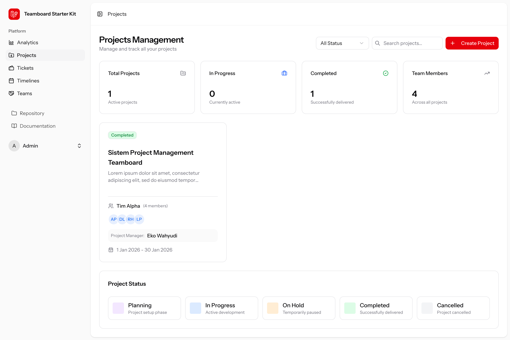
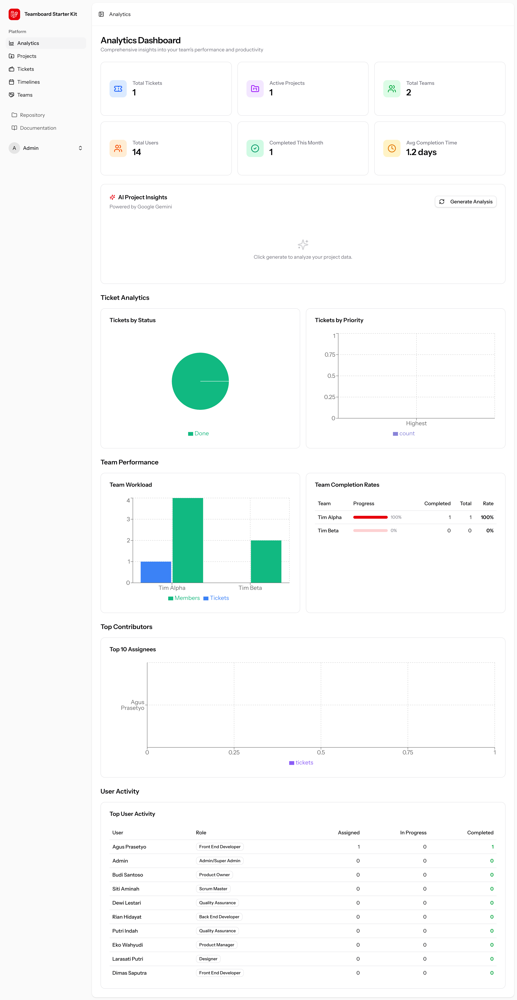
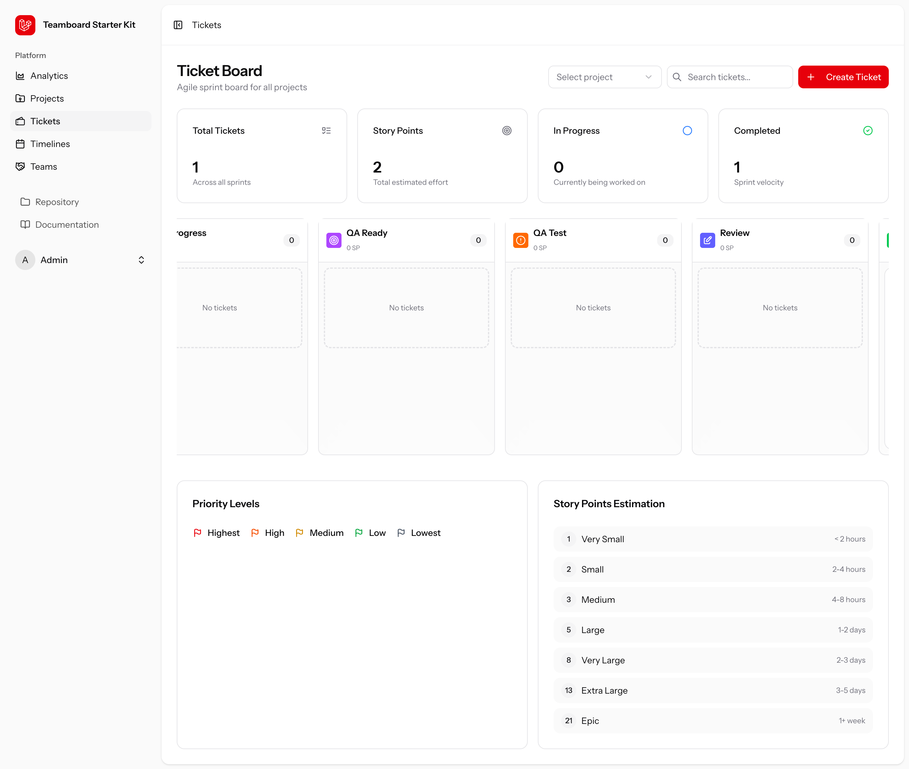
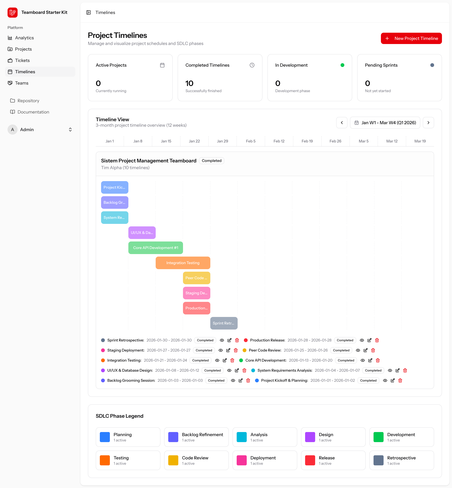
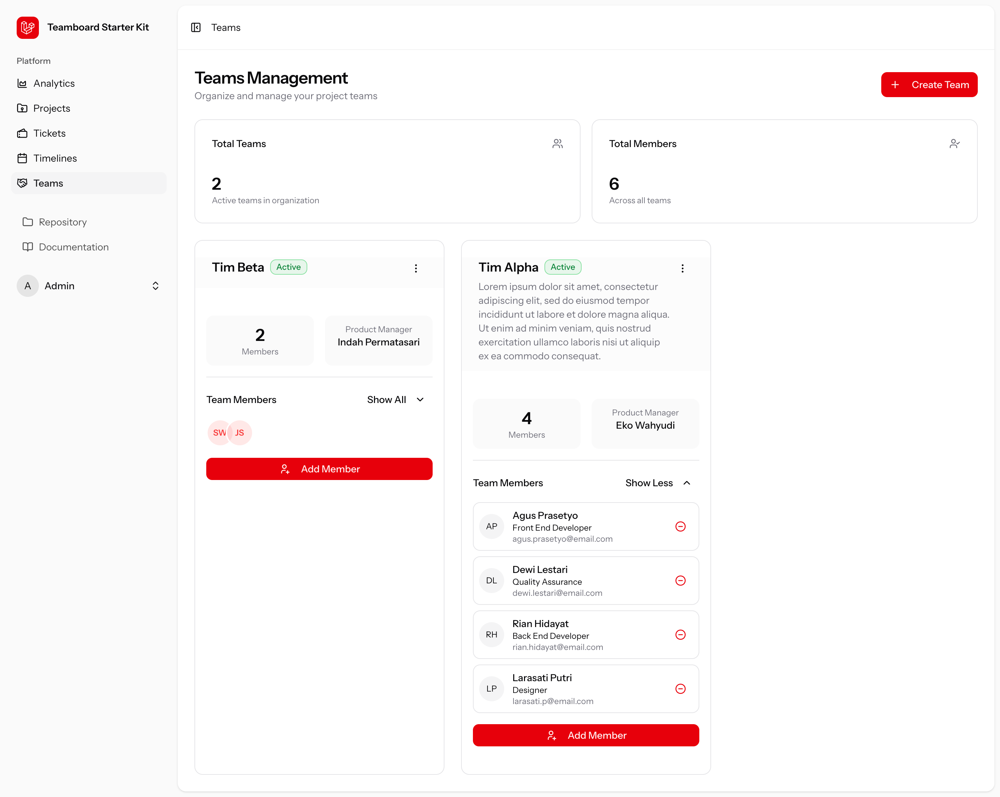
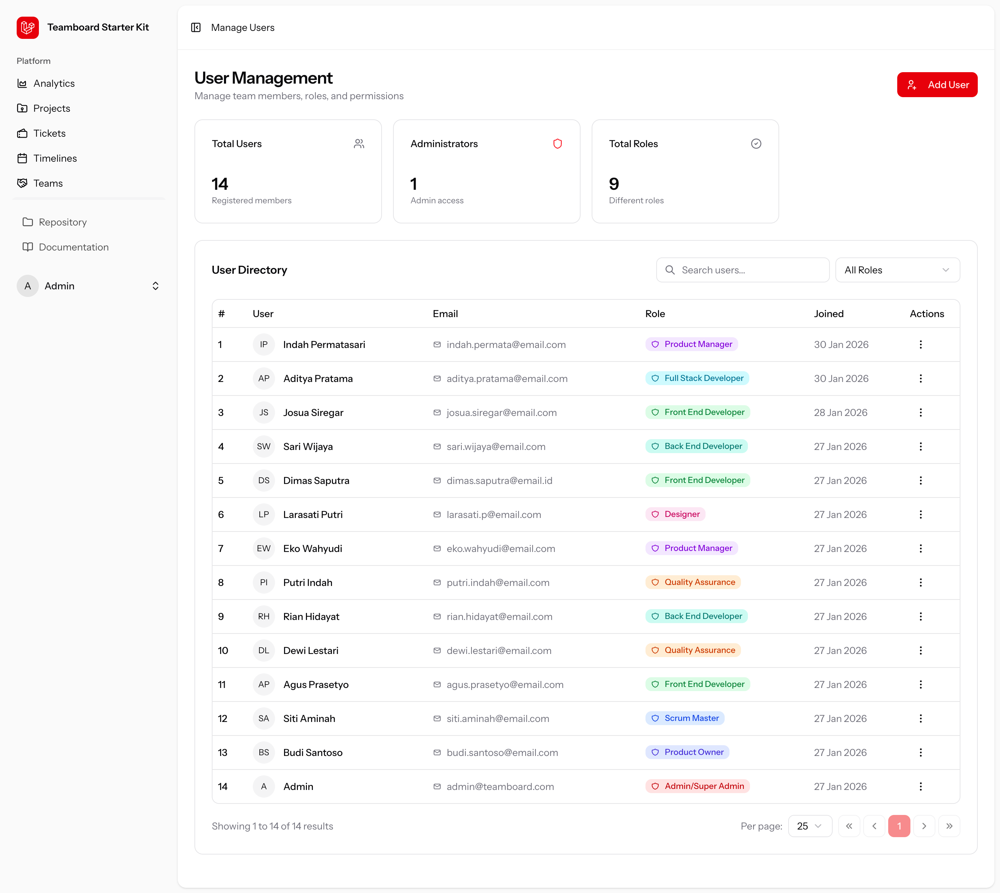
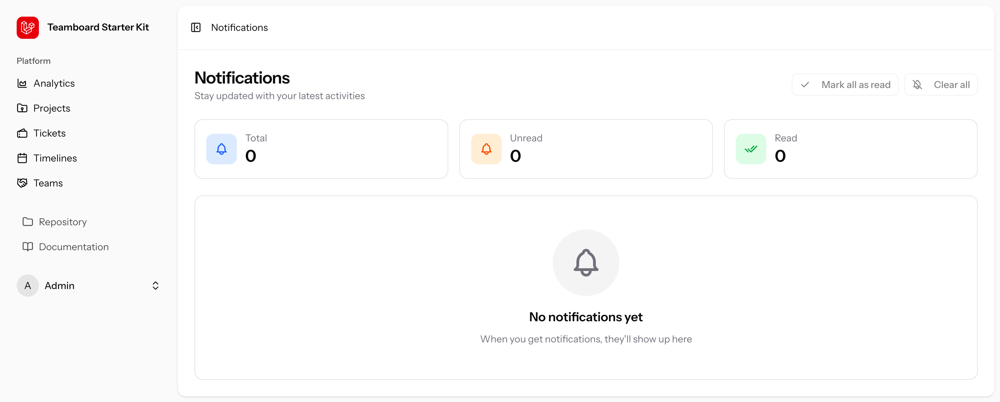

# Teamboard

Teamboard adalah aplikasi Manajemen Proyek modern yang dirancang untuk menyederhanakan kolaborasi tim, pelacakan tugas, dan analitik performa. **Terinspirasi oleh Jira**, proyek ini berfungsi sebagai versi "Lite", berfokus pada fitur-fitur *agile* yang esensial sekaligus menawarkan pengalaman pengguna yang lebih modern dan ringkas. Dibangun dengan teknologi web terkini, aplikasi ini memungkinkan tim untuk mengelola alur kerja secara efisien tanpa kerumitan alat tingkat perusahaan (*enterprise*).



## 📝 Deskripsi Proyek
Teamboard membantu tim untuk lebih produktif dengan menyediakan antarmuka yang bersih dan intuitif untuk mengelola proyek dan tiket (tugas). Fitur unggulan dari Teamboard adalah integrasinya dengan Google Gemini AI, yang dapat memberikan *insight* (wawasan) cerdas mengenai kesehatan proyek dan performa tim.

## 🚀 Fitur Utama
*   **Manajemen Proyek & Tugas**: Buat proyek, berikan tugas (*assign*), dan lacak progres dengan tampilan *board* (Kanban) dan *list* yang intuitif.
*   **Kolaborasi Tim**: Kelola anggota tim, peran (Product Owner, Scrum Master, Product Manager, Team Dev, UI/UX Designer), dan hak akses secara komprehensif.
*   **Analitik Didukung AI (Gemini)**: Hasilkan wawasan cerdas tentang kesehatan proyek, identifikasi hambatan, dan performa tim menggunakan Google Gemini AI.
*   **Timeline Interaktif**: Visualisasikan peta jalan (*roadmap*) proyek dan tenggat waktu agar tim selalu sesuai jadwal.
*   **Pembaruan Real-time**: Tetap sinkron dengan aktivitas tim Anda melalui pembaruan yang responsif.

## 🏗️ Arsitektur
Proyek ini menggunakan arsitektur **Monolith** modern dengan pola **SPA (Single Page Application)** yang dirender menggunakan **Inertia.js**.
*   **Backend**: Bertindak sebagai pemroses utama yang menangani logika bisnis, autentikasi, serta interaksi database menggunakan framework Laravel.
*   **Frontend**: Aplikasi React murni yang berjalan di sisi klien, namun menerima *routing* dan data *props* langsung dari sisi server melalui Inertia.js, sehingga menghilangkan kebutuhan untuk membangun dan memelihara REST API yang terpisah.
*   **Integrasi AI**: Memanfaatkan Google Gemini PHP Client di sisi server untuk memproses data proyek secara aman dan mengembalikan *insight* cerdas ke sisi klien.

## 🛠️ Teknologi yang Digunakan (Tech Stack)

### Backend
*   **[Laravel 12](https://laravel.com)**: Framework PHP elegan untuk membangun *backend* yang tangguh.
*   **[Inertia.js 2.0](https://inertiajs.com)**: Menjembatani Laravel dan React untuk membangun aplikasi *Single-Page* modern.
*   **[Google Gemini PHP](https://github.com/google-gemini-php/client)**: Library untuk integrasi dengan Google Generative AI.
*   **Database**: PostgreSQL.

### Frontend
*   **[React 19](https://react.dev)**: Library UI deklaratif untuk membangun antarmuka pengguna yang interaktif.
*   **[TypeScript](https://www.typescriptlang.org)**: Superset JavaScript dengan *static typing* untuk kode yang lebih aman dan mudah dipelihara.
*   **[Tailwind CSS 4.0](https://tailwindcss.com)**: Framework CSS *utility-first* untuk penataan gaya (*styling*) UI secara cepat dan konsisten.
*   **[Shadcn/ui](https://ui.shadcn.com)**: Kumpulan komponen UI siap pakai dan dapat dikustomisasi, dibangun di atas Radix UI dan Tailwind CSS.
*   **[Recharts](https://recharts.org)**: Library pembuat grafik yang dikomposisikan untuk React, digunakan pada dashboard analitik.
*   **[Tabler Icons](https://tabler.io/icons) & [Lucide React](https://lucide.dev)**: Pustaka ikon yang indah dan konsisten.

## 📋 Persyaratan (Requirements)
Sebelum menjalankan aplikasi ini, pastikan sistem Anda telah menginstal:
*   PHP >= 8.2
*   Composer (Package Manager PHP)
*   Node.js & NPM (atau Yarn/pnpm)
*   PostgreSQL (Server Database)
*   Git

## ⚙️ Cara Menjalankan Aplikasi

1.  **Kloning Repositori**
    ```bash
    git clone https://github.com/srgjo27/teamboard.git
    cd teamboard
    ```

2.  **Instal Dependensi PHP**
    ```bash
    composer install
    ```

3.  **Instal Dependensi Node.js**
    ```bash
    npm install
    ```

4.  **Konfigurasi Environment**
    Salin file environment contoh menjadi `.env`.
    ```bash
    cp .env.example .env
    ```

5.  **Generate Application Key**
    ```bash
    php artisan key:generate
    ```

6.  **Migrasi dan Seeding Database**
    Buat struktur tabel database dan isi dengan data referensi awal (seperti Role, Status, dsb).
    ```bash
    php artisan migrate --seed
    ```

7.  **Jalankan Aplikasi (Development)**
    Anda dapat menjalankan server *backend* (Laravel) dan *frontend* (Vite) secara bersamaan menggunakan command bawaan (dari `composer.json`):
    ```bash
    composer run dev
    ```
    Atau jika ingin menjalankannya secara terpisah di dua terminal berbeda:
    ```bash
    npm run dev
    # Di tab terminal baru:
    php artisan serve
    ```

    Akses aplikasi melalui browser pada alamat: `http://localhost:8000`.

## 🛠 Konfigurasi Tambahan

Pastikan Anda mengatur *environment variables* berikut di dalam file `.env` yang sudah disalin:

```ini
APP_URL=http://localhost:8000

# Konfigurasi Database (Gunakan PostgreSQL)
DB_CONNECTION=pgsql
DB_HOST=127.0.0.1
DB_PORT=5432
DB_DATABASE=teamboard
DB_USERNAME=postgres
DB_PASSWORD=password_database_anda

# Kunci API Google Gemini (Dibutuhkan untuk fitur AI Insights)
GEMINI_API_KEY=masukkan_api_key_anda_di_sini
```

## 📸 Tangkapan Layar (Screenshots)

| Projects | Analytics |
|----------|-----------|
|  |  |

| Tickets | Timelines |
|---------|-----------|
|  |  |

| Teams | Manage Users |
|-------|--------------|
|  |  |

### Notifikasi


## 📄 Lisensi

Proyek Teamboard adalah perangkat lunak *open-source* yang dilisensikan di bawah [Lisensi MIT](https://opensource.org/licenses/MIT).
